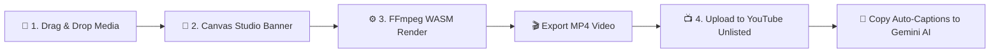

# ⚡ VidScribe Matrix (`v1.0 WASM`)

> **Flash Transcription Powered by YouTube!**  
> Convert long audio & video meeting recordings into ultra-lightweight, YouTube-accepted MP4 files right inside your browser with **zero server uploads**. Unlock **100% free auto-transcription** and instant **AI meeting notes via Gemini & ChatGPT**.

---

[](https://nextjs.org/)
[](https://react.dev/)
[](https://ffmpeg.org/)
[](https://www.typescriptlang.org/)
[](https://tailwindcss.com/)
[](https://github.com/somitrov/VidScribe)

---

## 🌟 Highlights & Features

- 🔒 **100% Zero-Server Privacy**: Everything runs completely in your browser via WebAssembly. Your confidential meeting recordings never touch any remote server!
- ⚡ **144p 1FPS Turbo WASM Engine**: Optimized for maximum speed! Renders visual banners at 256x144 (144p) at 1 frame per second to convert gigabytes of audio in seconds.
- 🎵 **Direct Audio Copy (`-c:a copy`)**: Bypasses audio re-encoding altogether, maintaining original audio fidelity with zero processing overhead.
- 🎨 **Interactive Canvas Studio**: Design sleek meeting banner overlays with real-time preview:
  - Custom presets (*Gradient Indigo*, *Dark Slate*, *Cyberpunk*, *Emerald Green*, *Crimson Danger*)
  - Custom background image uploads
  - Custom titles, subtitles, participant lists, and security badges
- 🎯 **YouTube Engine Hack**: Convert raw audio (MP3, M4A, WAV, OGG, FLAC) into MP4, upload to YouTube as *Unlisted*, and let YouTube's industry-leading Speech-to-Text engine auto-generate high-accuracy transcripts (especially for **Hindi & Hinglish** meetings!).
- 🤖 **Instant AI Notes**: Copy YouTube auto-captions into **Gemini / ChatGPT / Claude** to generate structured meeting summaries, key decisions, and action items effortlessly.

---

## 🔄 How It Works (The 4-Step Pipeline)



### 1. Ingest Media
Drag & drop any audio (`.mp3`, `.m4a`, `.wav`, `.aac`, `.flac`) or video file (`.mp4`, `.webm`, `.mkv`).

### 2. Design Visual Banner
Add meeting metadata, participant tags, confidential badges, and custom branding colors.

### 3. Convert via FFmpeg WASM
Click **Start WASM Conversion**. WebAssembly compiles the visual banner and audio track into a YouTube-compliant MP4 file entirely in memory.

### 4. Upload to YouTube & Get AI Notes
Upload the exported MP4 to YouTube as **Unlisted**. Wait a few minutes for YouTube to generate auto-captions, then copy the transcript directly into **Gemini** for instant summary notes!

---

## 🚀 Quick Start & Installation

### Prerequisites

Make sure you have **Node.js 18+** installed on your system.

```bash
# Clone the repository
git clone https://github.com/somitrov/VidScribe.git

# Navigate into the directory
cd VidScribe

# Install dependencies
npm install

# Start the development server
npm run dev
```

Open https://vidscribe.hirelancer.in/ in your browser to start converting!

---

## 🛠️ Tech Stack & Architecture

| Component | Technology | Description |
| :--- | :--- | :--- |
| **Framework** | Next.js 15 (App Router) | High-performance React application framework |
| **UI Library** | React 19 & Tailwind CSS | Modern, sleek dark-mode glassmorphic UI |
| **Media Processing** | `@ffmpeg/ffmpeg` (WASM) | Client-side WebAssembly FFmpeg binary runner |
| **Icons** | Lucide React | Clean, crisp UI icons |
| **Confetti** | Canvas Confetti | Celebration effects upon completion |

---

## 💡 Why YouTube Auto-Captions?

> **The Problem:** Standard Speech-to-Text APIs (like OpenAI Whisper API or Google Speech) can be expensive, complex to set up, or struggle with code-switched languages like **Hindi + English (Hinglish)**.
> 
> **The Solution:** YouTube has built the world's most advanced multilingual Speech-to-Text engine for free auto-captions. By turning audio files into lightweight 144p videos with **VidScribe Matrix**, you can leverage YouTube's free captioning pipeline securely and effortlessly!

---

## 🛡️ Security & Privacy Guarantee

- 💻 **Client-Side Execution**: All media processing, canvas rendering, and FFmpeg operations happen in-browser on your device.
- 🚫 **No Analytics / No Tracking**: No audio data or user inputs are collected or sent anywhere.

---

## 🤝 Contributing

Contributions, issues, and feature requests are welcome!  
Feel free to check the [issues page](https://github.com/somitrov/VidScribe/issues).

---

<div align="center">

Made with ❤️ by [Somit](https://github.com/somitrov) • Powered by **Next.js & FFmpeg WebAssembly**

</div>
